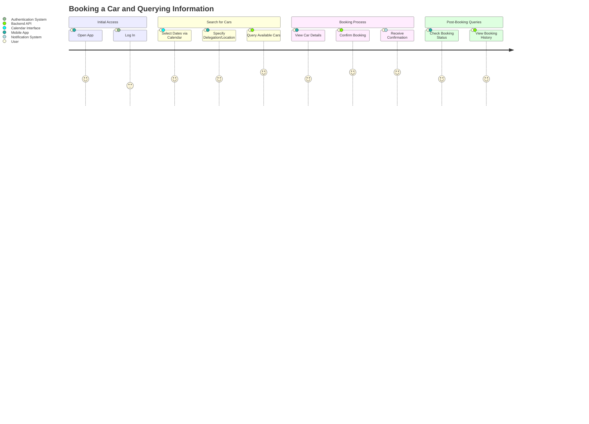

# User Journey and Queries

Below is the Mermaid.js code for a User Journey Diagram that captures the user journey for creating a booking and performing queries. The diagram breaks the process into distinct sections, assigns satisfaction scores (from 1 to 5, where 1 is very negative and 5 is very positive), and identifies the participants involved in each step. 

---

## Explanation of the User Journey

- **Initial Access**: The journey begins with the user opening the app and logging in. Satisfaction is moderate (3-4) as login might involve minor friction like entering credentials or delays in authentication.

- **Search for Cars**: The user selects rental dates using a calendar interface and specifies a delegation or location. Querying available cars is a high point (score 5) due to the expected ease of seeing real-time results.

- **Booking Process**: Viewing car details and confirming the booking are satisfying steps (4-5), especially with immediate backend confirmation and a notification to reassure the user of success.
  
  ### Steps not included in the MVP

- **Post-Booking Queries**: After booking, the user can check the status or view their booking history. These steps are rated positively (4) assuming a user-friendly interface and quick API responses.

# Data Models

## Data Model 1: Single-Table with Delegation-Car Hierarchy

- **Table Structure**: Single Table (`RentalData`)
  
  - **Partition Key (PK)**: `DelegationID` (e.g., `DEL#<delegation_id>`) - Groups data by delegation (location or event).
  
  - **Sort Key (SK)**: Hierarchical prefix (e.g., `CAR#<car_id>`) - Embeds car data under delegation for sorting and filtering.
  
  - **Attributes**:
    
    - `Make`: Car manufacturer (e.g., Toyota)
    
    - `Model`: Car model name (e.g., Corolla)
    
    - `Year`: Manufacturing year (e.g., 2020)
    
    - `Category`: Car type (e.g., Economy)
    
    - `DailyRate`: Rental cost per day (e.g., $50.00)
    
    - `IsAvailable`: Boolean for basic availability status
    
    - `LocationID`: Specific branch or location identifier
  
  - **User Entity (Same Table)**:
    
    - **PK**: `UserID` (e.g., `USER#<user_id>`) - Groups user data.
    
    - **SK**: `BOOKING#<booking_date>#<booking_id>` - Orders bookings by date for range queries.
    
    - **Attributes**: User details, booking specifics (car, dates).
  
  - **Indexes**: GSI1 (PK: `IsAvailable`, SK: `DelegationID`) for availability queries.

- **Advantages**:
  
  - Single-table design reduces costs and simplifies schema management.
  
  - Hierarchical SK enables efficient car retrieval under delegation with range queries.

- **Disadvantages**:
  
  - Complex SK design may increase query complexity for non-hierarchical access.
  
  - GSI overhead for availability queries adds provisioned throughput costs.

## Data Model 2: Two-Table Design with Delegation-Car and User-Booking Separation

- **Table 1 Structure**: `DelegationCars`
  
  - **Partition Key (PK)**: `DelegationID` (e.g., `DEL#<delegation_id>`) - Groups by delegation.
  
  - **Sort Key (SK)**: `CAR#<car_id>` - Sorts cars within delegation.
  
  - **Attributes**:
    
    - `Make`, `Model`, `Year`, `Category`, `DailyRate`, `AvailabilityDates` (string or list for date ranges), `LocationID`.
  
  - **Indexes**: GSI1 (PK: `LocationID`, SK: `AvailabilityDates`) for location-based availability.

- **Table 2 Structure**: `UserBookings`
  
  - **PK**: `UserID` (e.g., `USER#<user_id>`) - Groups by user.
  
  - **SK**: `BOOKING#<booking_date>` - Orders bookings chronologically.
  
  - **Attributes**: Booking details (car ID, dates, delegation).
  
  - **Indexes**: None initially.

- **Advantages**:
  
  - Separated tables simplify access patterns for delegation vs. user queries.
  
  - Clear data isolation reduces risk of query conflicts 

- **Disadvantages**:
  
  - Higher cost due to multiple tables and separate throughput provisioning
  
  - More complex app logic to manage cross-table relationships.

## Data Model 3: Single-Table with Composite Car Availability in SK

- **Table Structure**: Single Table (`RentalData`)
  
  - **Partition Key (PK)**: `DelegationID` (e.g., `DEL#<delegation_id>`)
  
  - **Sort Key (SK)**: `CAR#<car_id>#<availability_status>` - Embeds availability status in SK for sorting (e.g., `CAR#123#AVAILABLE`).
  
  - **Attributes**: `Make`, `Model`, `Year`, `Category`, `DailyRate`, `LocationID`.
  
  - **User Entity (Same Table)**:
    
    - **PK**: `UserID` (e.g., `USER#<user_id>`)
    
    - **SK**: `BOOKING#<booking_date>#<booking_id>`
    
    - **Attributes**: Booking details.
  
  - **Indexes**: GSI1 (PK: `LocationID`, SK: `SK`) for location-car queries.

- **Advantages**:
  
  - Availability in SK allows direct sorting/filtering without extra indexes.
  
  - Single-table design optimizes cost and scalability 

- **Disadvantages**:
  
  - Updating availability requires item deletion and recreation, complicating updates
  
  - SK complexity may slow down certain queries.

## Data Model 4: Single-Table with Date-Based Car Availability

- **Table Structure**: Single Table (`RentalData`)
  
  - **Partition Key (PK)**: `DelegationID` (e.g., `DEL#<delegation_id>`)
  
  - **Sort Key (SK)**: `CAR#<car_id>#<start_date>` - Embeds availability start date for range queries.
  
  - **Attributes**: `Make`, `Model`, `Year`, `Category`, `DailyRate`, `EndDate`, `LocationID`.
  
  - **User Entity (Same Table)**:
    
    - **PK**: `UserID` (e.g., `USER#<user_id>`)
    
    - **SK**: `BOOKING#<booking_date>#<booking_id>`
    
    - **Attributes**: Booking details.
  
  - **Indexes**: GSI1 (PK: `LocationID`, SK: `StartDate`) for date-location queries.

- **Advantages**:
  
  - Supports calendar-based queries with date range in SK (e.g., `between` operator)
  
  - Efficient for booking availability checks.

- **Disadvantages**:
  
  - Frequent updates to date fields require careful handling to avoid data loss
  
  - Additional index costs for cross-delegation queries

## Data Model 5: Single-Table with Category-Based Car Sorting

- **Table Structure**: Single Table (`RentalData`)
  
  - **Partition Key (PK)**: `DelegationID` (e.g., `DEL#<delegation_id>`)
  
  - **Sort Key (SK)**: `CAR#<category>#<car_id>` - Groups cars by category within delegation for filtering.
  
  - **Attributes**: `Make`, `Model`, `Year`, `DailyRate`, `IsAvailable`, `LocationID`.
  
  - **User Entity (Same Table)**:
    
    - **PK**: `UserID` (e.g., `USER#<user_id>`)
    
    - **SK**: `BOOKING#<booking_date>#<booking_id>`
    
    - **Attributes**: Booking details.
  
  - **Indexes**: GSI1 (PK: `Category`, SK: `DelegationID`) for category-wide queries.

- **Advantages**:
  
  - Hierarchical SK supports filtering cars by category efficiently (e.g., `begins_with`) 
  
  - Single-table design keeps costs low

- **Disadvantages**:
  
  - Less focus on availability dates, requiring additional attributes or indexes.
  
  - Category changes may complicate SK updates
